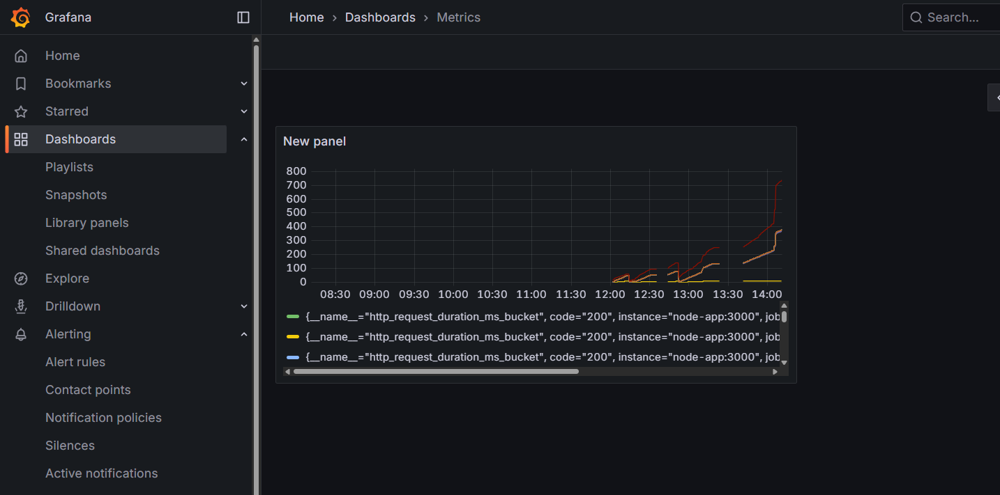
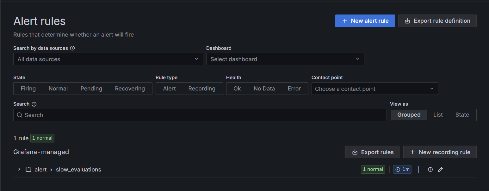
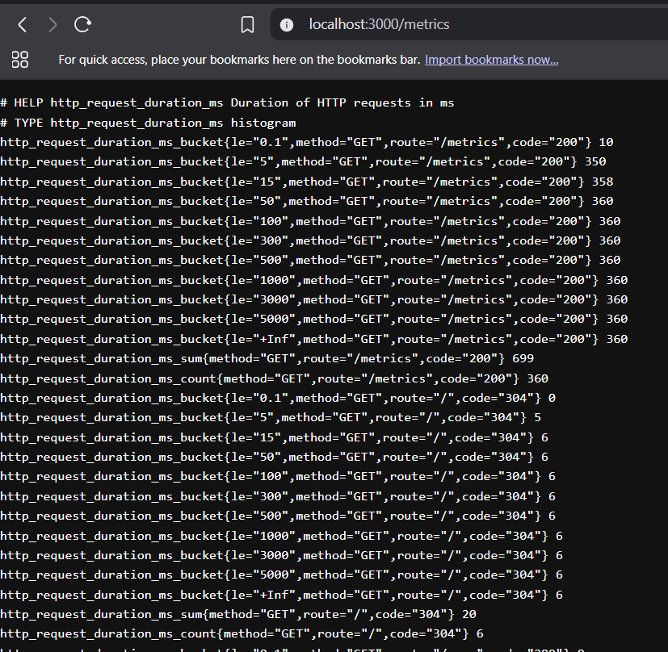

# Prometheus Monitoring Integration

This project demonstrates how to integrate Prometheus metrics collection into a Node.js (Express) application and visualize metrics with Grafana. It includes a ready-to-run local setup and a Docker Compose stack with Prometheus and Grafana.

## Features

- **Histogram for request durations**: `http_request_duration_ms` labeled by method, route, and status code.
- **Metrics endpoint**: Exposes `/metrics` in Prometheus exposition format via `prom-client`.
- **Example routes**: `GET /`, `GET /user`, `POST /user` for demo traffic.
- **Docker Compose stack**: Brings up the app, Prometheus, and Grafana.

## Tech Stack

- Node.js + Express (TypeScript)
- prom-client
- Prometheus
- Grafana

## Project Structure

```
src/
  index.ts                 # Express app, routes, /metrics
  middleware.ts            # Basic timing log middleware
  monitering/
    requestCount.ts        # Histogram metric + middleware
    activeRequests.ts      # Gauge for active requests (optional)
Dockerfile                 # Container for the Node app
docker-compose.yml         # App + Prometheus + Grafana
prometheus.yml             # Prometheus scrape config
```

## Prerequisites

- Node.js 20+ (uses Node 20 in Docker)
- npm
- Docker & Docker Compose (optional, for containerized setup)

## Local Development (without Docker)

1. Install dependencies:
   ```bash
   npm install
   ```

2. Build and start:
   ```bash
   npm start
   ```

3. Test the app:
   - Health check: `GET http://localhost:3000/`
   - Get user: `GET http://localhost:3000/user`
   - Create user: `POST http://localhost:3000/user`
   - Metrics: `GET http://localhost:3000/metrics`

   Example curl:
   ```bash
   curl -i http://localhost:3000/
   curl -i http://localhost:3000/user
   curl -i -X POST http://localhost:3000/user -H "Content-Type: application/json" -d '{"name":"Alice"}'
   curl -i http://localhost:3000/metrics
   ```

## Docker Compose Stack (App + Prometheus + Grafana)

1. Build the TypeScript output locally (so `dist/` exists for the container):
   ```bash
   npm run build
   ```

2. Start the stack:
   ```bash
   docker compose up --build
   ```

3. Access services:
   - **App**: `http://localhost:3000`
   - **Prometheus Start**: docker run -p 9090:9090 -v ./prometheus.yml:/etc/prometheus/prometheus.yml prom/prometheus
   - **Prometheus UI**: `http://localhost:9090`
   - **Grafana**: `http://localhost:3001`

   Grafana default login: username `admin`, password `admin` (as configured via `GF_SECURITY_ADMIN_PASSWORD`).

4. Generate some traffic to see metrics:
   ```bash
   for i in {1..20}; do curl -s http://localhost:3000/user >/dev/null; done
   ```

## Prometheus Configuration

Prometheus is configured in `prometheus.yml` and, in Docker, scrapes the app by service name:

```yaml
scrape_configs:
  - job_name: 'nodejs-app'
    static_configs:
      - targets: ['node-app:3000']
```

You can also add additional scrape targets. There is an example external target included in the file.

## Available Metrics

- `http_request_duration_ms{method,route,code}`: Histogram for request durations in milliseconds.
- `process_*`, `nodejs_*`: Standard `prom-client`/runtime metrics if enabled.
- `active_requests` (optional): Gauge for in-flight requests. To enable, uncomment `cleanupMiddleware` in `src/index.ts` and include it as middleware.

## Grafana Setup

1. Open Grafana at `http://localhost:3001`.
2. Add Prometheus data source:
   - URL: `http://prometheus:9090` (from within Grafana container) or `http://localhost:9090` if adding from your host via UI proxy.
3. Create a dashboard panel and query:
   - Example: `rate(http_request_duration_ms_count[1m])` or visualize duration quantiles using histogram functions.

## Scripts

- `npm run build`: Type-check and compile TypeScript to `dist/`.
- `npm start`: Build then run `node dist/index.js`.

## Troubleshooting

- App container starts but exits immediately:
  - Ensure `dist/` exists in the build context. Run `npm run build` before `docker compose up --build`.

- Prometheus shows target down:
  - Confirm the app is reachable from the Prometheus container at `node-app:3000` (Compose network). From host, check `http://localhost:3000/metrics`.

- Grafana cannot reach Prometheus:
  - Use the internal URL `http://prometheus:9090` when configuring the data source from Grafana.

## License

ISC






